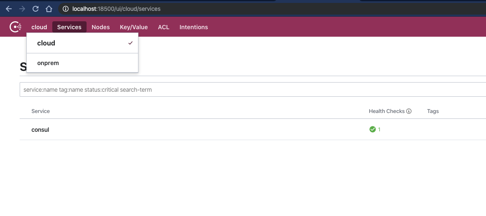

# Federating Datacenters

Consul has the ability to join multiple datacenters together, this allows services located in one datacenter to discover the location for services in other datacenters. When related to service mesh, it allows traffic to be transparently routed between all services and datacenters in the mesh. Your service which is running on a virtual machine in the datacenter `onprem` can communicate with services running in kubernetes in the datacenter `cloud`. As far as the service running in the `onprem` datacenter is concerned it is communicating with another local service. Consul does all the heavy lifting and management of security.

In order to federate Consul Datacenters (DC), the two DCs need to communicate using the WAN Gossip protocol. WAN Gossip allows the two DCs to share service catalogs and configuration. For service traffic to be routable between DCs you also need to expose a `Consul gateway`, you will see how to accomplish that in the next section. In this section we are going to concentrate purely on joining two clusters.

## Running the VM based DC

In the `examples/federation/` folder you will find a `docker-compose.yml` file which we are going to use to simulate our Virtual Machine based DC.

This is very similar to the example we used in [Getting Started](getting_started.html), however; note this example has a secondary network `wan`.

```yaml
version: '3'
services:
  # Consul server on VM
  consul:
    networks:
      onprem:
        ipv4_address: 10.5.0.2
      wan:
        ipv4_address: 192.169.7.2

networks:
  onprem:
    driver: bridge
    ipam:
     config:
       - subnet: 10.5.0.0/16
  wan:
    driver: bridge
    ipam:
     config:
       - subnet: 192.169.7.0/24
```

The network `onprem` is the main network which the virtual machines (docker containers) will use for their communication, the `wan` network is going to be used for Consul DC to Consul DC communication. No application will be connected to this network. You can regard the `wan` network either like a secondary `VPC` or even the `public internet`.

There are also a couple of additional configuration options we need to add in order to federate clusters.

`primary_datacenter`, for single cluster, it is sufficient to define only `datacenter`, however; when joining multiple datacenters one of them has to be marked as the primary. The primary datacenter is responsible for managing the root certificate and holding consensus over configuration.

`advertise_addr`, we now have multiple ip addresses for the server, we need to select the primary address which be used for internal communication.

`advertise_addr_wan`, which ip address should be used for DC-DC Gossip, external consul servers must be able to reach this IP address


Our config file in `examples/federation/consul_config/consul.hcl` has these values already set, we are using the internal network ip for the advertise_addr and the wan ip for the advertise_addr_wan. We are also setting this datacenter, `onprem`, as the primary.

```ruby
datacenter = "onprem"

# ...

primary_datacenter = "onprem"

advertise_addr = "10.5.0.2"
advertise_addr_wan = "192.169.7.2"
```

Let's start our `onprem` Consul cluster:

```bash
➜ docker-compose up
Creating network "federation_onprem" with driver "bridge"
Creating network "federation_wan" with driver "bridge"
Creating federation_consul_1 ... done
Attaching to federation_consul_1
```

## Running the Kubernetes DC

Now we have our `onprem` virtual machines datacenter running we need to run another datacenter in Kubernetes. In order to configure the primary datacenter we need to override some of the defaults which are in the helm chart. We can do this by passing custom values to the helm chart for Consul.

If you look at the file `examples/federation/helm-values.yml`, we are overriding the `datacenter` and calling it cloud. We then have the `primary_datacenter` which is set to `onprem`. Finally we are setting the `retry_join_wan` option. `retry_join_wan` takes a list of ip addresses. When the Consul server starts it will use these addresses to join another datacenter. Once the other datacenter has been joined an anti-entropy sync is performed to fetch the initial configuration and cluster member information. Any other datacenters which are members of the group will also be automatically discovered. The address we are using for `retry_join_wan` is the `wan` ip address of our virtual machines cluster started in the previous step.

```yaml
global:
  datacenter: cloud

server:
  extraConfig: |
    {
      "primary_datacenter": "onprem", 
      "advertise_addr_wan": "192.169.7.130", 
      "retry_join_wan": ["192.169.7.2"]
    }
```

Let's create our Kubernetes cluster using `Shipyard`, this time we are going to need to connect our K8s cluster to the `wan` network which the `onprem` cluster is also connected to. We are also going to assign it the ip address `192.169.7.100` so the machine is connected to the `wan` network.

Shipyard will create the new k8s cluster in docker and then attach it to the `wan` network with the correct ip. Admittedly this is slightly simplified over the infrastructure wrangling you would have to do to set this up in a cloud provider. But the principle is the same, you have two networks, one for your internal datacenter traffic and one for datacenter to datacenter traffic.

We can achieve this with the following command. Note the two flags `consul-port` and `consul-values`, these allow us to override the default port for accessing Consul (onprem has already claimed 8500), and a convenient way of getting Shipyard to override the helm-values when it installs Consul.

```shell
yard up --consul-port 18500 \
        --consul-values $PWD/helm-values.yml \
        --network federation_wan \
        --network-ip 192.169.7.100
```

Run this command in your terminal now:

```shell
➜ yard up --consul-port 18500 \
        --consul-values $PWD/helm-values.yml \
        --network federation_wan \
        --network-ip 192.169.7.100

     _______. __    __   __  .______   ____    ____  ___      .______       _______  
    /       ||  |  |  | |  | |   _  \  \   \  /   / /   \     |   _  \     |       \ 
   |   (----`|  |__|  | |  | |  |_)  |  \   \/   / /  ^  \    |  |_)  |    |  .--.  |
    \   \    |   __   | |  | |   ___/    \_    _/ /  /_\  \   |      /     |  |  |  |
.----)   |   |  |  |  | |  | |  |          |  |  /  _____  \  |  |\  \----.|  .--.  |
|_______/    |__|  |__| |__| | _|          |__| /__/     \__\ | _| `._____||_______/ 


Version: 0.2.2

## Creating K8s cluster in Docker and installing Consul

#...

Consul can be accessed at: http://localhost:18500
Kubernetes dashboard can be accessed at: http://localhost:8443

To expose Kubernetes pods or services use the 'yard expose' command. e.g.
yard expose svc/myservice 8080 8080

When finished use "yard down" to cleanup and remove resources
```

Now to make Consul reachable, we will also need start a port-forward on the ip `192.169.7.130`, which we have defined as our `advertise_addr_wan` in our Consul configuration.

```shell
yard expose \
  --bind-ip none \
  --network federation_wan \
  --network-ip 192.169.7.130 \
  --service-name svc/consul-consul-server \
  --port 8600:8600 \
  --port 8500:8500 \
  --port 8302:8302 \
  --port 8301:8301 \
  --port 8300:8300
```

Once that is up and running you can test that the two datacenters have been federated by using the `consul members -wan` command. You will see that both of your clusters are now listed `onprem` and `cloud`.

```shell
➜ consul members -wan
Node                          Address             Status  Type    Build  Protocol  DC      Segment
1182f82647e4.onprem           192.169.7.2:8302    alive   server  1.6.1  2         onprem  <all>
consul-consul-server-0.cloud  192.169.7.130:8302  alive   server  1.6.1  2         cloud   <all>
```

If you look at the Consul UI in your browser: [onprem - http://localhost:8500](http://localhost:8500) or [cloud - http://localhost:18500](http://localhost:18500) you can also navigate between datacenters and see their services from a single UI.



Ok that is federation done, next step Gateways. Remember to clean up your clusters by running:

```
$ yard down
$ docker-compose down
```

## Summary
In this section you have learned to join multiple datacenters, this is a core technique in order to enable cross datacenter communication using Consul Service Mesh. In the next section you will learn about Gateways which are used as bridges for service traffic and see how easy it is for services in different datacenters to communicate.

[Next - Configuring Gateways](gateways.hcl)
