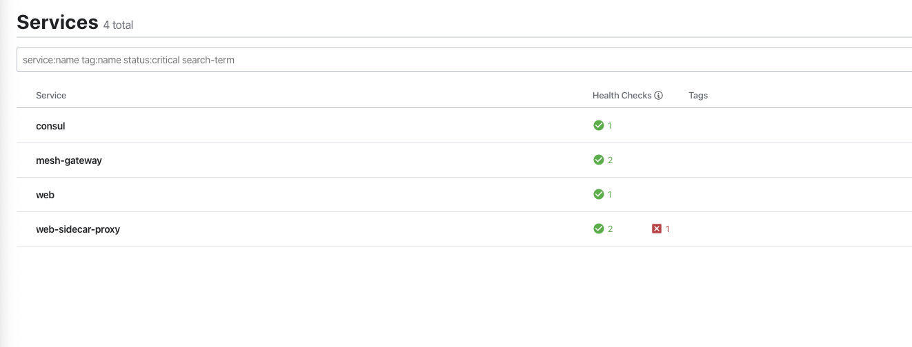
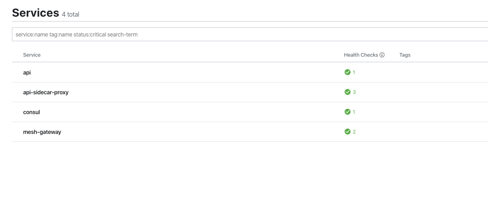
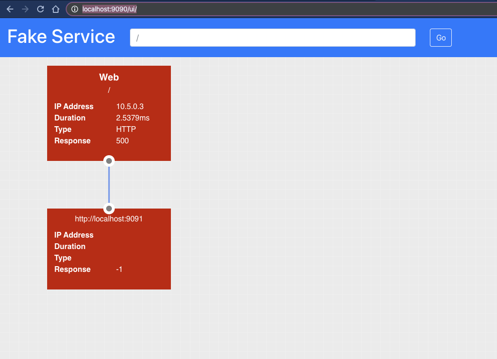
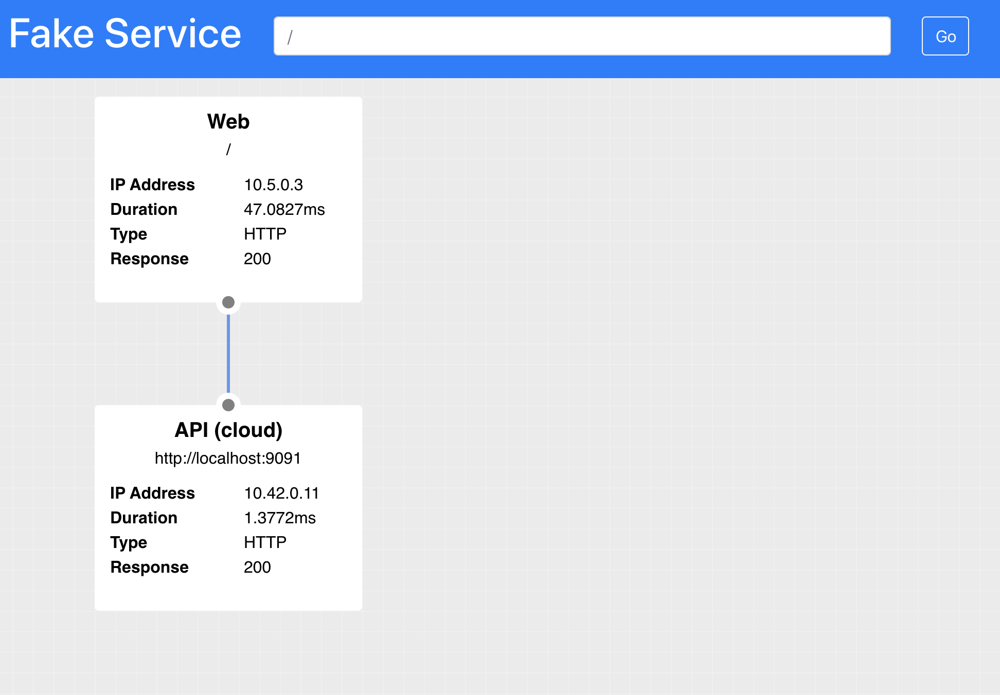

# Configuring Gateways

Gateways allow secure communication between clusters, they circumvent the requirement for a flat network which all services are running on and can be even run on the public internet to facilitate cloud to cloud communication.

In this example we have two services:
* Web (onprem)
* API (cloud)

The `Web` service is running in a VM in the `onprem` datacenter and needs to communicate with the `API` service which is running in Kubernetes in the `cloud` datacenter. The network which the `onprem` datacenter runs in is not accessible from the `cloud` datacenter's network.

To enable traffic to flow between the two datacenters we are going to deploy a Consul Gateway into both Datacenters. The Gateway will bridge the internal network and the wan network allowing traffic to be transparently proxied between datacenters.

## Configuring Gateways for VMs

The file `examples/gateways/docker-compose.yml` expands on what we were using in the previous example. We have added the same web service which was used in the first example. If you examine the configuration `examples/gateways/server_config/web.hcl` you will also see that this is exactly the same as the first example. Unlike the first example this time the `API` service is going to be hosted separate datacenter and in a Kubernetes cluster.

To enable cross-datacenter service mesh traffic we use a Gateway, a Gateway is a bridge between two networks. To run a Gateway we can use a very similar technique to running the data plane. That is the `consul connect envoy` command. Gateways like Data plane proxies are just Envoy instances which have been specifically configured by Consul.

For our Web service to communicate to the API it will still use the data plane (Envoy), however; rather than the data plane talking direct to the API data plane in the other cluster it will talk to its local gateway. The gateway can bridge two networks and will forward the connection to the other datacenters gateway. Since the two gateways are on the same network this communication  is possible, the gateway in the `onprem` datacenter could not however talk direct to the API application which is running in the `cloud` datacenter as these are on different networks. For this reason the `onprem` gateway sends the traffic to the `cloud` gateway, it is then the responsibility of the `cloud` gateway which also sits inside the Kubernetes cluster to forward the request to the API.

The nice thing about gateways is that they can not decrypt the traffic they are transferring, Consul uses SNI headers to enable transparent TLS proxying of your data.

Let's see how we run a gateway, the command we use to start a gateway is as follows. We are still using the `consul connect envoy` main command however this time we are using the flags: 

* `-mesh-gateway`  - Generate the bootstrap config required for envoy
* `-register` - Register the new service inside Consul
* `-address` - The local address and port to bind the gateway to
* `wan-address` - The address and port used for external connections

```
consul \
connect envoy  \
-mesh-gateway \
-register \
-address 10.5.0.33:8443 \
-wan-address 192.169.7.33:8443
```

For our simple Docker example we can add a gateway using another service declaration, add the following block to the `docker-compose.yml` located in the `examples/gateways` folder.

```yaml
  gateway:
    image: nicholasjackson/consul-envoy:v1.6.1-v0.10.0
    environment:
      CONSUL_HTTP_ADDR: 10.5.0.2:8500
      CONSUL_GRPC_ADDR: 10.5.0.2:8502
    command: [
      "consul",
      "connect", "envoy",
      "-mesh-gateway",
      "-register",
      "-address", "10.5.0.33:8443",
      "-wan-address", "192.169.7.33:8443",
      "--",
      "-l", "debug"]
    networks:
      onprem:
        ipv4_address: 10.5.0.33
      wan:
        ipv4_address: 192.169.7.33
```

Once you have added the gateway you can start your VM cluster.

```
➜ docker-compose up
Creating network "gateways_onprem" with driver "bridge"
Creating network "gateways_wan" with driver "bridge"
Creating gateways_consul_1 ... done
Creating gateways_web_1    ... done
Attaching to gateways_web_1, gateways_consul_1
```

If you look at the Consul UI [http://localhost:8500/ui](http://localhost:8500/ui), you will see that the gateway has been started and is registered in Consul. Note the `red x` next to the web-sidecar-proxy. The reason that this service is marked as unhealthy is because the required upstream service `API` does not exist. We are going to look at that next.




## Configuring Gateways in Kubernetes
Now we have the gateway running in our Virtual Machine environment we need to create a gateway in Kubernetes. This is achieved by overriding values in the Helm values.

When we federated the two datacenters we used the following config:

```
---
global:
  datacenter: cloud

server:
  extraConfig: |
    {
      "advertise_addr_wan": "192.169.7.130",
      "primary_datacenter": "onprem",
      "retry_join_wan": ["192.169.7.2"]
    }
```

The Helm chart allows us to configure how we can run a Gateway in Kubernetes using the `meshGateway` block. In this block we are going to configure the `wanAddress` similar to how we did this for the Virtual Machine. We are going to set this value to the IP address of an external load balancer which we will later point at the service created by the Helm Chart.

We also want to create a Kubernetes service for the Gateways. The settings for the Gateway will differ from environment to environment but typically you will create `n` Gateway instances and point an external or internal loadbalancer at them. It is the address of the loadbalancer which needs to be accessible to other datacenters.

```
meshGateway:
  enabled: true
  mode: local
  replicas: 1
  wanAddress:
    useNodeIP: false
    host: "192.169.7.140"
  service:
    enabled: true
    type: ClusterIP
    port: 443
```

The file `helm-values.yml` file in the folder `examples/gateways` has already been pre-populated with these values. We can start our K8s cluster using the same command in the previous section. Run this in your terminal now:

```
yard up --consul-port 18500 \
        --consul-values $PWD/helm-values.yml \
        --network gateways_wan \
        --network-ip 192.169.7.100

yard expose --bind-ip none \
        --network gateways_wan \
        --network-ip 192.169.7.130 \
        --service-name svc/consul-consul-server \
        --port 8600:8600 \
        --port 8500:8500 \
        --port 8302:8302 \
        --port 8301:8301 \
        --port 8300:8300
```

Now we have the Consul cluster and the Gateway running we need to expose a loabalancer to it so that it is accessible from the `onprem` cluster. If you were building this setup in the Cloud you would most likely use a Kubernetes `Service` of type `LoadBalancer` to create an expose the gateways. Running things locally we can not do that so we will have to simulate the process instead.

We can use `Shipyards` capability to expose a Kubernetes service to either your local computer or another docker network. Using this tool we can create our fake loadbalancer which will expose the gateway to the `wan` network.

Run the following command in your terminal:

```
yard expose \
--bind-ip none \
--network gateways_wan \
--network-ip 192.169.7.140 \
--service-name svc/consul-consul-mesh-gateway \
--port 443:443
```

Now everything is up and running, both clusters and their respective gateways you can deploy the api to the `cloud` datacenter.

```
➜ kubectl apply -f api.yaml 
deployment.apps/api created
```

If you look at the Consul UI [http://localhost:18500/ui](http://localhost:18599/ui), you should see your `api` service and the `mesh-gateway`.



## Configuring service resolution
Your clusters and applications are now all up and running, however; if you visit the `web` service [http://localhost:9090/ui](http://localhost:9090/ui). You will see that there is still an upstream error.



Even though the two datacenters are federated and there are gateways linking the two systems, by default the service mesh will always resolve to the local datacenter. In our setup we do not have an `api` service running in the `onprem` datacenter so this is causing an error.

We can resolve this by explicitly telling Consul to resolve the `API` service to the `cloud` datacenter with L7 config.

A `service-resolver` allows you to configure features for service resolution such as `redirects`, `subsets` and much more. 

[https://www.consul.io/docs/agent/config-entries/service-resolver.html](https://www.consul.io/docs/agent/config-entries/service-resolver.html)

In this example you are going to use the `redirect` capability which allows the explicit resolution of a service to a particular datacenter. By default a service will always attempt to resolve to its own datacenter. The `service-resolver` config entry allows you to override that behaviour.

The following example can be found in the file `examples\gateways\l7_config\api_resolver.hcl`.

```ruby
kind = "service-resolver"
name = "api"

redirect {
  service    = "api"
  datacenter = "cloud"
}
```

Configuration entries can be written using with the `consul config write` command.

Write this file to your cluster:

```shell
consul config write api_resolver.hcl`
```

When you view the `Web` service in your browser the `API` will now be resolving correctly.

[http://localhost:9090/ui](http://localhost:9090/ui)



## Summary

In this section you have learned how to use Consul Gateways to allow traffic to transparently and securely be routed from datacenter to datacenter. In the next example we will put all of this together to see how we can migrate our applications.

Before continuing don't forget to clean up:

```shell
yard down
#...

Version: 0.2.4

## Stopping Kubernetes and cleaning resources
2da15daeb08b
ad47c5aa6dd0
INFO[0000] Removing cluster [shipyard]
INFO[0000] ...Removing server
INFO[0002] ...Removing docker image volume
INFO[0002] Removed cluster [shipyard]
```

```shell
docker-compose down
Stopping gateway_consul_1  ... done
Stopping gateway_api_1     ... done
```
