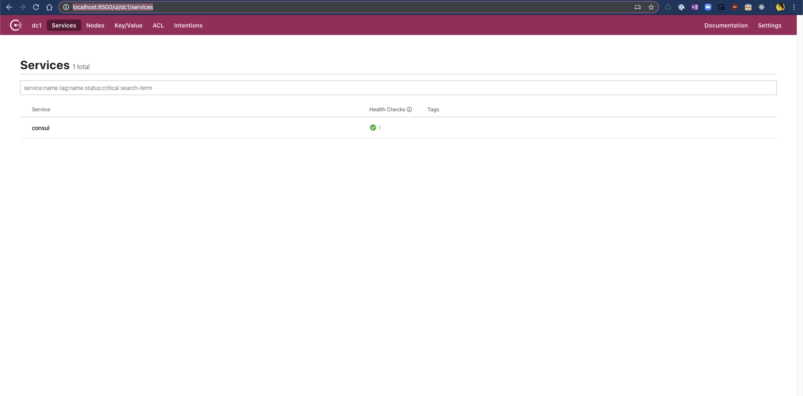
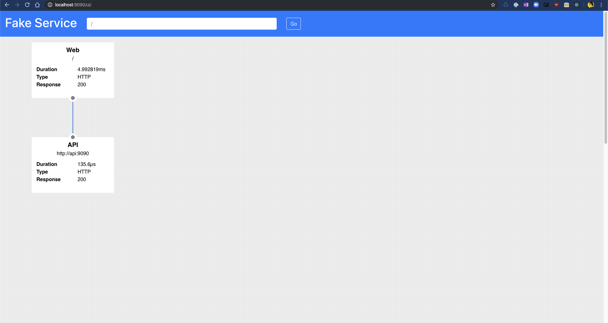
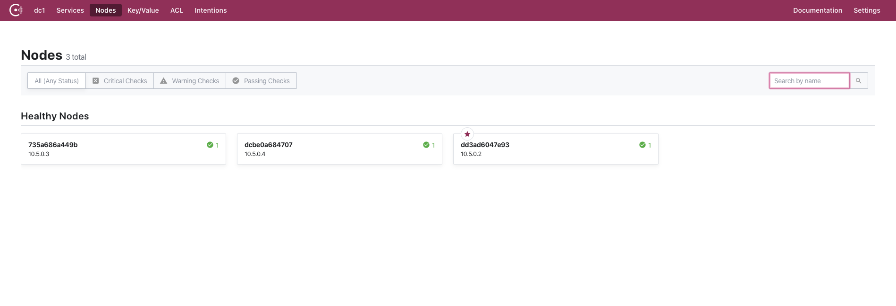
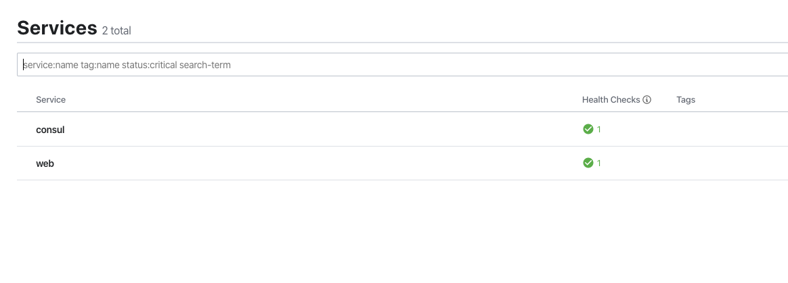
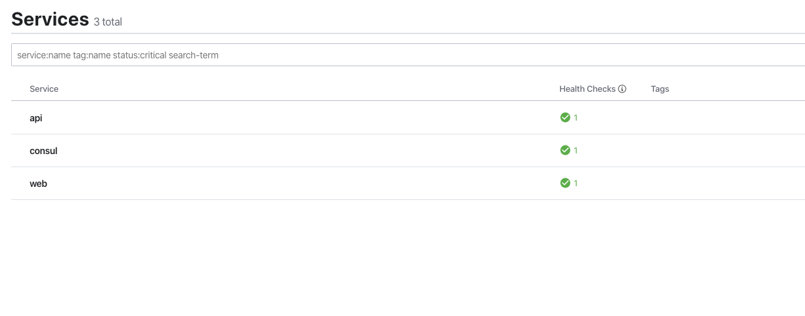
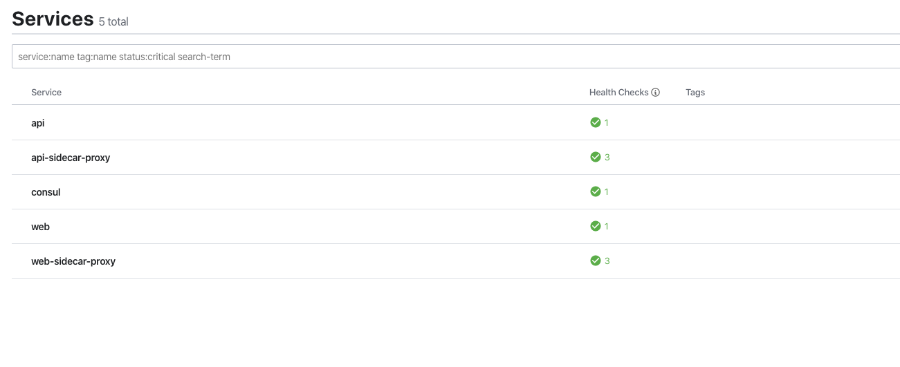
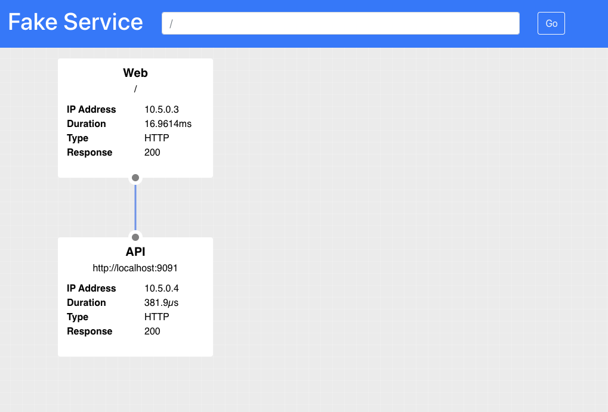

# Getting Started

This exercise familiarizes you with Consul and how it works with your application.

Run the file `docker-compose.yml` in the `examples\getting_started` to start a Consul server and two services.

```bash
➜ docker-compose up  
Creating network "getting_started_vpcbr" with driver "bridge"
Creating getting_started_api_1    ... done
Creating getting_started_consul_1 ... done
Creating getting_started_web_1    ... done
Attaching to getting_started_api_1, getting_started_consul_1, getting_started_web_1
```

The Docker Compose file has three services:
* Consul
* Web
* API

The `Web` and `API` services are not typical Docker containers, for this demo we are simulating Virtual Machines. These services do not follow the standard convention of a single binary running in a container, instead we are running multiple processes using `supervisor`.

You should be able to access the consul server in your browser at [http://localhost:8500](http://localhost:8500)




You will also be able to access the application which is running at [http://localhost:9090](http://localhost:9090)



The typical Consul architecture is that you have a server cluster, normally 3/5/7 nodes, and an agent which runs on each node. The agent
is responsible for performing health checks against its local service. Loadbalancing requests to the server nodes. Caching data, and can act as a DNS server transforming DNS requests into Consul service catalog requests.

On your `api` and `api` Docker containers the Consul Agent is running with `supervisor`, this is a basic configuration, which allows us to set the datacenter name, the retry-join address in order to connect to the server, and a few other options.

```bash
[program:consul]
command=/usr/local/bin/consul agent -datacenter %(ENV_CONSUL_DATACENTER)s -config-dir /config -client 0.0.0.0 -retry-join %(ENV_CONSUL_SERVER)s -bind 0.0.0.0 -grpc-port=8502 -data-dir /tmp -hcl "enable_central_service_config = true"
autorestart=true
priority=100
```

If you click on the `Nodes` menu item in the Consul UI, you should see 3 nodes, the server, and the two agents for the `web` and `api` services.



For full details on Consul options and configuration please checkout the Consul documentation:
[https://www.consul.io/docs/agent/options.html](https://www.consul.io/docs/agent/options.html)

The Learn platform also has a number of tutorials on configuring Consul clusters:
[https://learn.hashicorp.com/consul?track=getting-started](https://learn.hashicorp.com/consul)

## Registering Services

In order to register a service we need to tell consul about the service. This is typically performed using a config file for each service. The following definition is the minimum information for our demo. We are going to specify the `name` of the service which will be registered in the service catalog. The `id` for this particular service instance, this must be unique across all service instances. And the port which the service is running on.

```ruby
service {
  name    = "web"      # Service name
  id      = "web-v1"   # Specific to the particular service instance, if omitted defaults to name
  port    = 9090       # Add the port to the service catalog 
}
```

The service definition file is specific to the service instance, and the most convenient way to register this is to add it to the agents config folder. When an agent starts or receives a reload command it will automatically process files in this folder.

Create this file and save it as `web.hcl`.

Since your Consul agent already has a `config-dir` set to /config we can use a Docker volume to drop this file into your Fake VM.

```yaml
    volumes:
      - "./server_config/web.hcl:/config/web.hcl"
```

If you look at the UI you will now see that the service has been registered.



Repeat this process for the `API` service.

If you completed this correctly you should now see 3 services registered in the Consul UI.



## Enabling Service Mesh

In addition to registering the service we need to add a DataPlane or proxy for the service to be part of the service mesh. To do this we can use the command `consul connect envoy -sidecar-for [service id]`. This command automatically generates the configuration required for the Envoy data plane and starts it. When running on a virtual machine, you would typically run this command with something like `supervisor`. An example of this configuration can be found below:

```bash
[program:envoy]
command=/bin/bash -c "/usr/local/bin/consul connect envoy -sidecar-for %(ENV_SERVICE_ID)s -envoy-binary /usr/local/bin/envoy"
autorestart=true
startretries=300
priority=200
```

The `web` and `api` services already have this process running in supervisor, however, simply setting the `SERVICE_ID` environment variable is not enough to enable the service mesh. You have to modify the configuration for your service, explicitly telling consul that proxies are enabled for this particular service instance.

This is completed using the `connect` stanza, for a default configuration you can simply register an empty `sidecar_service` block in your service configuration.

Add the following `connect` stanza to your `web` and `api` service config. **Note:** This block is a child of the main `service` stanza.

```ruby
  connect {
    sidecar_service {}
  }
```

You should end up with something which looks like:

```ruby
service {
  name = "api"
  id   = "api-v1"
  port = 9090

  connect {
    sidecar_service {}
  }
}
```

Once you have added the stanza to both files, restart your docker-compose configuration, you should see the sidecar proxies shown in the services view:



## Configuring upstreams

You now have your dataplanes configured for each of the services, however; there is one final step, we need to ensure that the traffic between the services is routed through the proxy.  Registering each proxy will enable an inbound connection for each of the services but for outbound connections we need to explicitly define these upstream routes.  

Your web service needs to communicate to the API service so let's configure an upstream for this. An upstream stanza configures the dataplane to expose another service on a local port. All service discovery and loadbalancing to the different service instances will be handled by the dataplane. Your application only needs to make a connection to localhost.

To allow a connection to the API service you can configure an `upstream` stanza like the following. This block has the `destination_name` defined, this is the name of the service you would like to communicate with.  The `local_bind_port` allows you to configure which `localhost` port to use for this service.

```ruby
upstreams {
  destination_name   = "api"
  local_bind_port    = 9091
}
```

Add this block to the service definition for your `web` service, your final service should look like the following example:

```ruby
service {
  name = "web"
  id   = "web-v1"
  port = 9090

  connect {
    sidecar_service {

      proxy {
        upstreams {
          destination_name   = "api"
          local_bind_port    = 9091
        }
      }
    }
  }
}
```

In your `docker-compose.yml` the environment variable `UPSTREAM_URIS` is set to `http://api:9090`. Change this value to `http://localhost:9091` so that the Web service will use the service mesh to communicate with the API service. To make 100% sure that you are not sending any traffic over the docker network you can change the environment variable `LISTEN_ADDR` on the `api` service. Currently this is bound to all IP addresses. However; when you are using a service mesh only the dataplane needs public ingress so it is possible to change this to only listen on localhost `LISTEN_ADDR: localhost:9090`.  

Once all these changes have been made, restart your application:

```
# Ctrl-C
Killing getting_started_web_1     ... done
Killing getting_started_api_1     ... done
Killing getting_started_consul_1  ... done

$ docker-compose up
```

and reload the Web service at `http://localhost:9090/ui`. You should still see the API service successfully called however the URI is not http://localhost:9091 instead of http://api:9090.



## Summary
In this section you have learned how to configure two existing services inside of a service mesh. The next section will look at how we can enable Consul Service Mesh for your new Greenfield service in Kubernetes.

[Next](kubernetes.html)