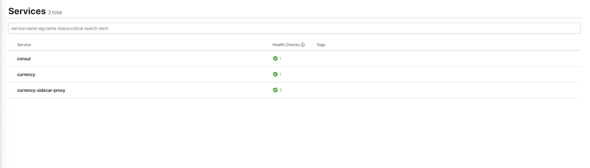
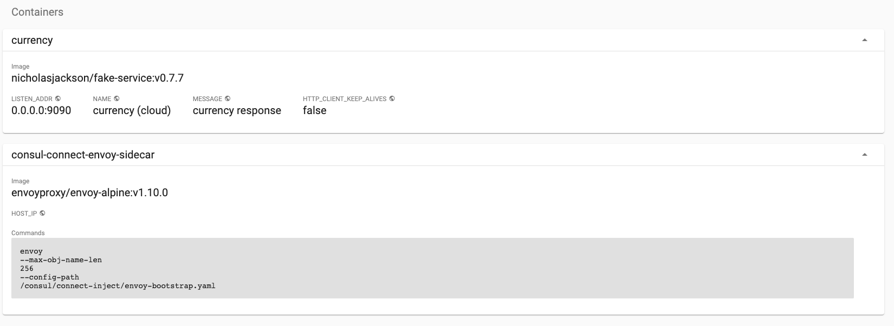

# Kubernetes

In this exercise you will learn the basics of running an application using Consul Service Mesh in Kubernetes.  This example will use a local Kuberernetes cluster which has `Consul` pre-configured using the tool [Shipyard](https://shipyard.demo.gs).

For more through walk through on how to run Consul on Kubernetes including setup and configuration of the Helm chart you can check out
our Instruqt platform:

https://instruqt.com/hashicorp/tracks/service-mesh-with-consul-k8s

If you have not already installed `Shipyard`, you can do that now with the following command:

```
curl https://shipyard.demo.gs/install.sh | bash
```

Once Shipyard has been installed you can use the command `yard up` to create a Kubernetes cluster and install Consul. Normally this process takes around 1m to complete, however; it may take longer first run as `Shipyard` needs to download and cache a few Docker images.

```bash
$ yard up

     _______. __    __   __  .______   ____    ____  ___      .______       _______  
    /       ||  |  |  | |  | |   _  \  \   \  /   / /   \     |   _  \     |       \ 
   |   (----`|  |__|  | |  | |  |_)  |  \   \/   / /  ^  \    |  |_)  |    |  .--.  |
    \   \    |   __   | |  | |   ___/    \_    _/ /  /_\  \   |      /     |  |  |  |
.----)   |   |  |  |  | |  | |  |          |  |  /  _____  \  |  |\  \----.|  .--.  |
|_______/    |__|  |__| |__| | _|          |__| /__/     \__\ | _| `._____||_______/ 


Version: 0.2.2

## Creating K8s cluster in Docker and installing Consul

#...

### Setup complete:

To interact with Kubernetes set your KUBECONFIG environment variable
export KUBECONFIG="$HOME/.shipyard/shipyard/kubeconfig.yml"

Consul can be accessed at: http://localhost:8500
Kubernetes dashboard can be accessed at: http://localhost:8443

To expose Kubernetes pods or services use the 'yard expose' command. e.g.
yard expose svc/myservice 8080 8080

When finished use "yard down" to cleanup and remove resources
```

**NOTE**: If you received an error about port 8500 already being allocated, double check that you have removed the resources created in the previous example.

## Interacting with Kubernetes
If you have `kubectl` installed you can set the environment variable `KUBECONFIG` and then interact with the cluster as you would
any kubernetes cluster.

```
$ export KUBECONFIG="$HOME/.shipyard/shipyard/kubeconfig.yml"

$ kubectl get pods
NAME                                                              READY   STATUS    RESTARTS   AGE
consul-consul-connect-injector-webhook-deployment-c46d9888s2497   1/1     Running   0          16m
consul-consul-server-0                                            1/1     Running   0          16m
consul-consul-mmz9z                                               1/1     Running   0          16m
```

If you do not have `kubectl`, you can use `Shipyard's` interactive shell. The interactive shell has `kubectl`, `consul` CLI, and many other tools pre-installed. By default when you run the interactive shell, your current working folder is mapped to the `/work` folder.

```bash
$ yard tools

## Running tools container

To expose service in Kubernetes to localhost use:
port forwarding e.g.

kubectl port-forward --address 0.0.0.0 svc/myservice 10000:80

Mapping ports 10000-10100 on localhost to
10000-10100 on container.

Linking container --network k3d-shipyard
Setting environment -e CONSUL_HTTP_ADDR=http://k3d-shipyard-server:30443

root@575e9d9345f9:/work# ls
consul_config  docker-compose-final.yml  docker-compose.yml  server_config
root@575e9d9345f9:/work# kubectl get pods
NAME                                                              READY   STATUS    RESTARTS   AGE
consul-consul-connect-injector-webhook-deployment-c46d9888s2497   1/1     Running   0          16m
consul-consul-server-0                                            1/1     Running   0          16m
consul-consul-mmz9z                                               1/1     Running   0          16m
```

## Installing services

The first application we would like to migrate to our new cluster is going to be our `Currency` service. The first step is to get this installed on our Kubernetes cluster. The folder `examples/kubernetes` contains the config file `currency.yaml`.  If you take a look at this file you will see that it has a single container defined and everything is standard to a deployment except the following lines:

```yaml
annotations:
  "consul.hashicorp.com/connect-inject": "true"
```

Consul service mesh in Kubernetes runs an admission controller, the annotation `"consul.hashicorp.com/connect-inject": "true"`, informs the controller that this pod needs to be service mesh enabled. Before the pod is deployed the controller will modify it adding the dataplane. Let`s run the file and see the product of this.

```bash
➜ kubectl apply -f currency.yaml 
deployment.apps/currency created
```

You should see the new service running, note that there are `2/2` containers however the deployment only defined a single container. This is because the Consul admission controller has automatically modified your deployment to enable the service mesh. 

```bash
➜ kubectl get pods
NAME                                                              READY   STATUS    RESTARTS   AGE
consul-consul-connect-injector-webhook-deployment-c46d9888s2497   1/1     Running   0          37m
consul-consul-server-0                                            1/1     Running   0          37m
consul-consul-mmz9z                                               1/1     Running   0          37m
currency-5b64b6c67c-76f8m                                         2/2     Running   0          4m55s
```

The service will automatically be registered with Consul, unlike dealing with VMs, the Kubernetes controller manages this whole process for you.

[http://localhost:8500/ui/](http://localhost:8500/ui)


If you run `kubectl describe pod currency-your-id`, you will see the additional container which has automatically been created.

```
kubectl describe pod currency-5b64b6c67c-76f8m

#...

Containers:
  currency:
    Container ID:   containerd://6b76950a8beb3a3bb900bd03b7a6af079e2944af8048f4fd37787918a44b5f58
    Image:          nicholasjackson/fake-service:v0.7.7
    Image ID:       docker.io/nicholasjackson/fake-service@sha256:2e41a8c8e94ea0318d67ce82ea12fca8dfec4d916ff9a34246bf26713d4d369f
    Port:           9090/TCP
    Host Port:      0/TCP
    State:          Running
      Started:      Tue, 29 Oct 2019 09:48:46 +0000
    Ready:          True
    Restart Count:  0
    Environment:
      LISTEN_ADDR:              0.0.0.0:9090
      NAME:                     currency (cloud)
      MESSAGE:                  currency response
      HTTP_CLIENT_KEEP_ALIVES:  false
    Mounts:
      /var/run/secrets/kubernetes.io/serviceaccount from default-token-6jzl5 (ro)
  consul-connect-envoy-sidecar:
    Container ID:  containerd://f1a477b3a6e627ced43a74c14cbd568fae101d51ec5f3f58df06cc3becbac04d
    Image:         envoyproxy/envoy-alpine:v1.10.0
    Image ID:      sha256:0246380e4b703fd1f99605a8c31b288c088c078b80ee2de1d987ad819b06e1ec
    Port:          <none>
    Host Port:     <none>
    Command:
      envoy
      --max-obj-name-len
      256
      --config-path
      /consul/connect-inject/envoy-bootstrap.yaml
    State:          Running
      Started:      Tue, 29 Oct 2019 09:48:46 +0000
    Ready:          True
    Restart Count:  0
    Environment:
      HOST_IP:   (v1:status.hostIP)
    Mounts:
      /consul/connect-inject from consul-connect-inject-data (rw)
      /var/run/secrets/kubernetes.io/serviceaccount from default-token-6jzl5 (ro)
```

This information can also be accessed using the Kubernetes dashboard which is available at [http://localhost:8443](http://localhost:8443).



That is the end for this section, in the next section we are going to look at how we can connect our Consul datacenter running in VMs and the one we have running in Kubernetes. Before moving on to the next section, don't forget to clean up your cluster.

```bash
➜ yard down

     _______. __    __   __  .______   ____    ____  ___      .______       _______  
    /       ||  |  |  | |  | |   _  \  \   \  /   / /   \     |   _  \     |       \ 
   |   (----`|  |__|  | |  | |  |_)  |  \   \/   / /  ^  \    |  |_)  |    |  .--.  |
    \   \    |   __   | |  | |   ___/    \_    _/ /  /_\  \   |      /     |  |  |  |
.----)   |   |  |  |  | |  | |  |          |  |  /  _____  \  |  |\  \----.|  .--.  |
|_______/    |__|  |__| |__| | _|          |__| /__/     \__\ | _| `._____||_______/ 


Version: 0.2.2

## Stopping Kubernetes and cleaning resources
INFO[0000] Removing cluster [shipyard]                  
INFO[0000] ...Removing server                           
INFO[0001] ...Removing docker image volume              
INFO[0001] Removed cluster [shipyard]    
```

## Summary
In this example we took a quick look at how we can run our applications with Consul service mesh on Kubernetes. In the next example we will see how we can join together VMs and Kubernetes clusters.

[Federating Clusters](federating_clusters.html)