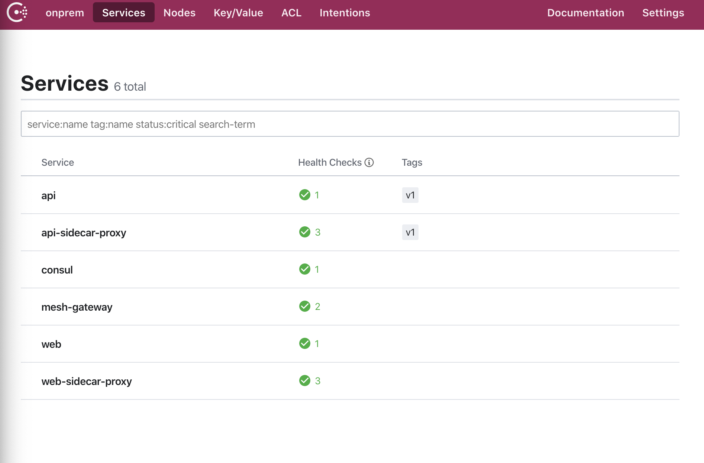
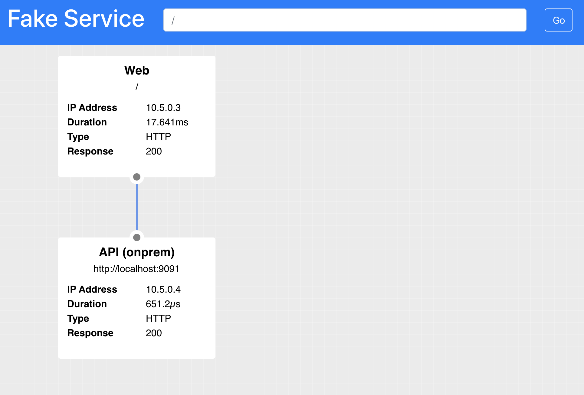
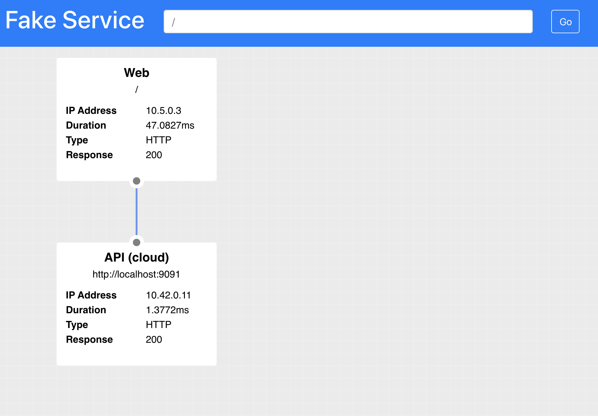

# Migrating applications to the cloud

In the previous example you looked at how you could connect the services of two Consul datacenters using Consul Gateways.

That example completed the setup for the infrastructure required to gracefully migrate applications to the cloud. In this example we will look at how we can use `Traffic Splitting` to allow gradual and controlled transition from the on-premise environment to Kubernetes.

The final example in this workshop will show you how to do just that. The first thing we need to do is to create our environment. This environment is going to be very similar to the previous one where we have an on-premise datacenter and our new Kubernetes datacenter. The on premise datacenter has the `Web` app with it's dependency on the `API` application running. We are going to slowly transition this `API` application to the new K8s cluster.

To start the environment you can run the `start.sh` script in the `examples/migration` folder. This will start the two clusters and federate them together with Consul gateways.

```shell
➜ ./start.sh
Creating network "migration_onprem" with driver "bridge"
Creating network "migration_wan" with driver "bridge"
Creating migration_consul_1  ... done
Creating migration_gateway_1 ... done
Creating migration_api_1     ... done
Creating migration_web_1     ... done
     _______. __    __   __  .______   ____    ____  ___      .______       _______
    /       ||  |  |  | |  | |   _  \  \   \  /   / /   \     |   _  \     |       \
   |   (----`|  |__|  | |  | |  |_)  |  \   \/   / /  ^  \    |  |_)  |    |  .--.  |
    \   \    |   __   | |  | |   ___/    \_    _/ /  /_\  \   |      /     |  |  |  |
.----)   |   |  |  |  | |  | |  |          |  |  /  _____  \  |  |\  \----.|  .--.  |
|_______/    |__|  |__| |__| | _|          |__| /__/     \__\ | _| `._____||_______/


Version: 0.2.4

## Creating K8s cluster in Docker and installing Consul
```

This should take about 1 minute to start.

Once the cluster is running if you look at the Consul UI in your browser `http://localhost:8500/ui`, you will see that the on-prem datacenter has the `web` and `api` applications running.



If you visit the Web application in your browser `http://localhost:9090/ui`, you will see the API is resolving to the on-premise datacenter.



You can now deploy the API service to Kubernetes, the `examples\migration` folder contains a file `api.yaml`. Apply this now using `kubectl`

```shell
root@2c214100642f:/work# kubectl apply -f api.yaml
deployment.apps/api created
```

If you look again at the Consul UI [http://localhost:8500/ui/cloud/services](http://localhost:8500/ui/cloud/services). You will see the `API` service is now running. However; refreshing the UI for the `Web` service [http://localhost:9090/ui/](http://localhost:9090/ui/). The API is still resolving to the on-premise instance.


In order to split traffic between the `onprem` and the `cloud` datacenters we need to create some L7 config like in our previous example. But this time we can not just use a simple redirect as this would immediately redirect all traffic. What we need to do is to create a `Virtual Service` and then a `Traffic Splitter` to weight requests between cloud and onprem.

The virtual service will look like the following. This is pretty much the same as the previous example, the difference being the name `api-cloud`. Consul allows us to define virtual services which point at real services.

```ruby
kind = "service-resolver"
name = "api-cloud"

redirect {
  service    = "api"
  datacenter = "cloud"
}
```

With this configuration deployed an upstream request for `api` would resolve to the local datacenters `api` instance. And an upstream request for `api-cloud` would resolve to the `api` instance in the `cloud` datacenter.

For convenience you wcan find this file in `examples\l7_config`. You can deploy this file using the command `consul config write`.

```
root@2c214100642f:/work/l7_config# consul config write api_cloud_resolver.hcl
```

On it's own this config will not have any effect on the system and all traffic will still be directed to the `onprem` datacenter. To change this behaviour we can use a `Service Splitter`.

A service splitter allows multiple splits to be defined, each of the splits can target a particular service or subset of a service. The weights for the splits are represented as a decimal percentage and must total 100. In the below example we are defining 100% of all traffic to go to the `api` service. Currently 0% of traffic is going to the virtual `api-cloud` service. 

```ruby
kind = "service-splitter"
name = "api"
splits = [
  {
    weight = 100
  },
  {
    weight  = 0
    service = "api-cloud"
  },
]
```

Apply this configuration using the command:

```shell
root@2c214100642f:/work/l7_config# consul config write api_cloud_resolver.hcl
```

If you check the `Web` service you will see that all traffic is till being directed to the `onprem` datacenter.

[http://localhost:9090/ui/](http://localhost:9090/ui/)

Let's update the service splitter to direct 50% of traffic to `api` and 50% to `api-cloud`. In production you would most likely take much smaller steps that this.

Update your `api_splitter.hcl` to the following values and re-apply the config.

```ruby
kind = "service-splitter"
name = "api"
splits = [
  {
    weight = 50
  },
  {
    weight  = 50
    service = "api-cloud"
  },
]
```

```shell
root@2c214100642f:/work/l7_config# consul config write api_cloud_resolver.hcl
```

Now when you refresh the `Web` UI you will see that it is splititng traffic between the `onprem` datacenter and the `cloud` datacenter.

[http://localhost:9090/ui/](http://localhost:9090/ui/)



Finally you can migrate 100% of traffic to the new `cloud` datacenter. Update your service splitter to the following values and apply it.

```ruby
kind = "service-splitter"
name = "api"
splits = [
  {
    weight = 0
  },
  {
    weight  = 100
    service = "api-cloud"
  },
]
```

```shell
root@2c214100642f:/work/l7_config# consul config write api_cloud_resolver.hcl
```

It is now possible to completely deprecate the old `onprem` version of the service and start migrating the next service.

## Summary
In this final example you have learned how to migrate traffic from a service in one datacenter to a new service running in your modern Kubernetes environment. 

There are many more possibilities for this technique such as splitting based on the presence of a HTTP header to do A/B testing or path based routing. 

All the current configuration options supported by Consul can be found in the documentation at the following location:

[https://www.consul.io/docs/agent/config_entries.html](https://www.consul.io/docs/agent/config_entries.html)

For some more examples, please check out my talk and demo repo from HashiConf 2019.

[https://youtu.be/Aq1uTozNajI](https://youtu.be/Aq1uTozNajI)

[https://github.com/nicholasjackson/demo-consul-service-mesh](https://github.com/nicholasjackson/demo-consul-service-mesh)
